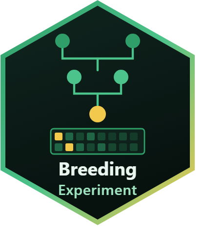

# BreedingExperiment <a href="https://mqfarooqi1.github.io/BreedingExperiment/"></a>

<!-- badges: start -->
[](https://lifecycle.r-lib.org/articles/stages.html#experimental)
[](https://github.com/mqfarooqi1/BreedingExperiment/actions/workflows/R-CMD-check.yaml)
[](https://mqfarooqi1.r-universe.dev/BreedingExperiment)
[](https://mqfarooqi1.github.io/BreedingExperiment/)
[](https://github.com/Bioconductor/BiocContributions/issues/117)
[](https://opensource.org/licenses/MIT)
<!-- badges: end -->

<!--
Bioconductor badges: add these once the package is accepted. Until then the
shields return 404, because Bioconductor has nothing to report yet.

[](https://bioconductor.org/packages/stats/bioc/BreedingExperiment/)
[](https://bioconductor.org/checkResults/release/bioc-LATEST/BreedingExperiment/)
[](https://bioconductor.org/packages/release/bioc/html/BreedingExperiment.html)
-->

**Bioconductor-style infrastructure for breeding and quantitative genomics:
genotypes, phenotypes, pedigree and marker coordinates in one object, with the
relationship matrices that quantitative genetics runs on.**

Bioconductor has excellent containers for expression, variants and single-cell
data. It has nothing for the shape of data a breeding programme actually
produces: a marker matrix, a phenotype table, a pedigree that reaches back
further than the genotyping did, and a marker map. This package provides that
container, and the matrices computed from it.

## Why a container

Keeping genotypes, phenotypes and pedigree in separate objects means every
filter or reordering is a chance to desynchronise them. `BreedingExperiment`
extends `RangedSummarizedExperiment`, so:

* markers are rows, individuals are columns, and subsetting keeps everything
  aligned;
* marker positions are a `GRanges`, so a data set can be cut to a region,
  overlapped with annotation, or handled with any Bioconductor tool that speaks
  genomic ranges;
* the pedigree travels with the data, and may include ancestors that were never
  genotyped.

## Installation

From [R-universe](https://mqfarooqi1.r-universe.dev/BreedingExperiment):

```r
install.packages("BreedingExperiment",
                 repos = c("https://mqfarooqi1.r-universe.dev",
                           "https://bioconductor.org/packages/release/bioc",
                           "https://cloud.r-project.org"))
```

Or from GitHub:

```r
# install.packages("BiocManager")
BiocManager::install("SummarizedExperiment")
remotes::install_github("mqfarooqi1/BreedingExperiment")
```

The package is [under review for Bioconductor](https://github.com/Bioconductor/BiocContributions/issues/117);
once accepted it will install with `BiocManager::install("BreedingExperiment")`.

## Use

```r
library(BreedingExperiment)

data(demoBreeding)
demoBreeding
#> class: BreedingExperiment
#> markers: 900  individuals genotyped: 120
#> assays(1): genotype
#> phenotypes(6): generation sex yield stature trueBV_yield trueBV_stature
#> sequences(10): chr1 chr2 chr3 chr4 chr5 chr6
#> pedigree: 180 individuals (120 genotyped, 60 not; 30 founders)
```

`demoBreeding` is a simulated five-generation population shaped like a real
programme: the two earliest generations were born before genotyping began, so
**60 of the 180 individuals have no markers**; one trait is recorded on females
only; a few sires dominate; and about one per cent of calls are missing. Use
`simulateBreeding()` to generate your own.

Your own data goes in the same way:

```r
be <- BreedingExperiment(
  genotypes  = dosage_matrix,        # markers x individuals, coded 0/1/2
  phenotypes = phenotype_table,      # one row per individual
  pedigree   = pedigree_table,       # id, sire, dam
  rowRanges  = marker_granges)       # marker positions
```

## Relationship matrices

| Function | Matrix | Source |
|---|---|---|
| `Amatrix()` | Pedigree numerator relationships | Henderson (1976) |
| `Gmatrix()` | Genomic relationships from markers | VanRaden (2008) |
| `Dmatrix()` | Dominance relationships | Vitezica et al. (2013) |
| `Hmatrix()` | **Single step: pedigree and markers combined** | Legarra et al. (2009); Christensen & Lund (2010) |

```r
A <- Amatrix(be)     # every individual in the pedigree
G <- Gmatrix(be)     # the genotyped ones
H <- Hmatrix(be)     # all of them, using both sources of information
```

### The single-step matrix

Real programmes genotype only part of the population. Using only `G` throws
away every ungenotyped relative; using only `A` throws away the markers.
`Hmatrix()` keeps both, so genotyped and ungenotyped individuals can be
analysed in one model — the relationship structure behind single-step genomic
prediction (ssGBLUP).

`G` is first tuned to the scale of `A22` and then blended with it, which also
guarantees the result is invertible when markers are fewer than individuals.

## Quality control

```r
be <- filterMarkers(be, min_maf = 0.05, min_call_rate = 0.9)
be <- imputeMarkers(be)
alleleFrequency(be)      # freq, maf, call rate, heterozygosity per marker
inbreeding(be)           # from the diagonal of A
```

## Correctness

The relationship matrices are checked against values that follow from theory,
not against a previous run: parent–offspring 0.5, grandparent 0.25, full sibs
0.5, the offspring of a full-sib mating inbred at F = 0.25, `H` positive
definite, and `Hmatrix(blend = 1)` reproducing `A22` exactly.

## Honest limitations

* **No mixed-model solver.** This package supplies the relationship structure;
  fit the model with whichever solver you prefer. That boundary is deliberate —
  solvers are a crowded field, containers are not.
* **The A matrix is dense.** The tabular method is `O(n²)` in memory, which is
  fine for tens of thousands of individuals but not for a national evaluation
  with millions. A sparse inverse is the obvious next step.
* **Imputation is mean imputation**, adequate only for the low missingness left
  after quality control. Impute properly upstream for anything more.
* **Diploid, biallelic markers only.**

## References

* Henderson, C. R. (1976) *Biometrics* **32**, 69–83. [doi:10.2307/2529339](https://doi.org/10.2307/2529339)
* VanRaden, P. M. (2008) *J. Dairy Sci.* **91**, 4414–4423. [doi:10.3168/jds.2007-0980](https://doi.org/10.3168/jds.2007-0980)
* Legarra, A., Aguilar, I. & Misztal, I. (2009) *J. Dairy Sci.* **92**, 4656–4663. [doi:10.3168/jds.2009-2061](https://doi.org/10.3168/jds.2009-2061)
* Christensen, O. F. & Lund, M. S. (2010) *Genet. Sel. Evol.* **42**, 2. [doi:10.1186/1297-9686-42-2](https://doi.org/10.1186/1297-9686-42-2)
* Aguilar, I. *et al.* (2010) *J. Dairy Sci.* **93**, 743–752. [doi:10.3168/jds.2009-2730](https://doi.org/10.3168/jds.2009-2730)
* Vitezica, Z. G., Varona, L. & Legarra, A. (2013) *Genetics* **195**, 1223–1230. [doi:10.1534/genetics.113.155176](https://doi.org/10.1534/genetics.113.155176)

---

MIT licensed. Muhammad Farooqi.
